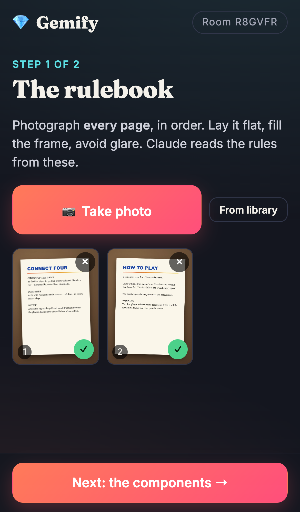
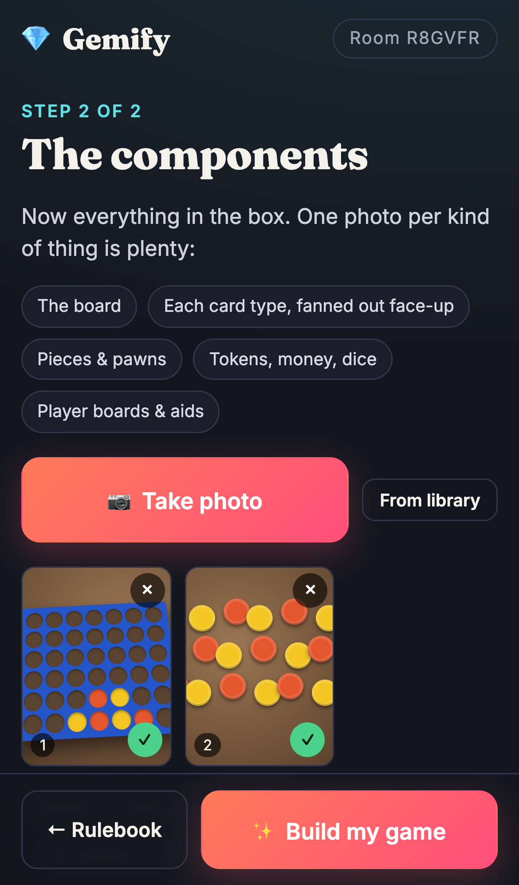
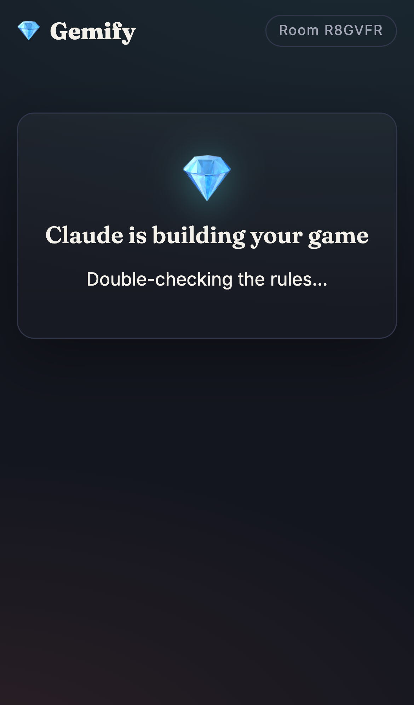
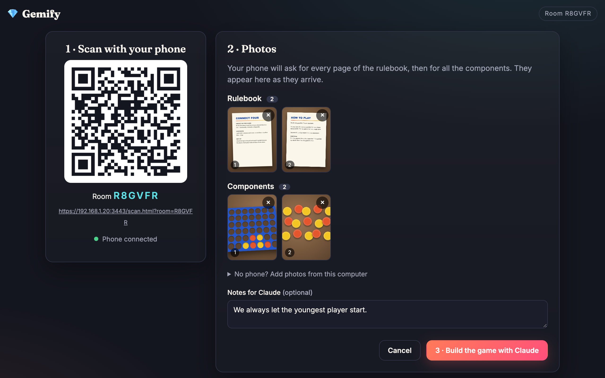
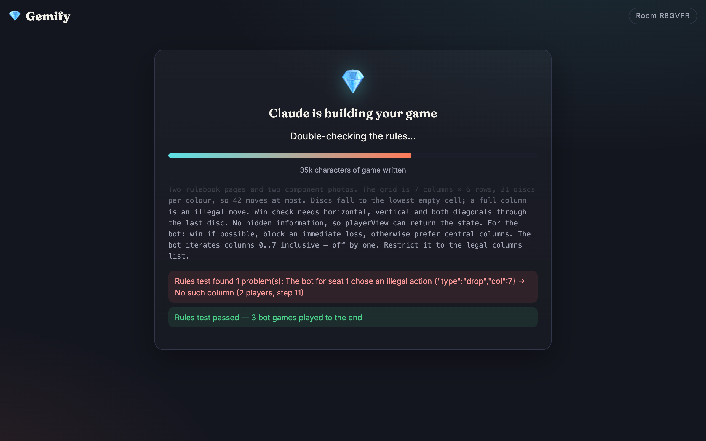
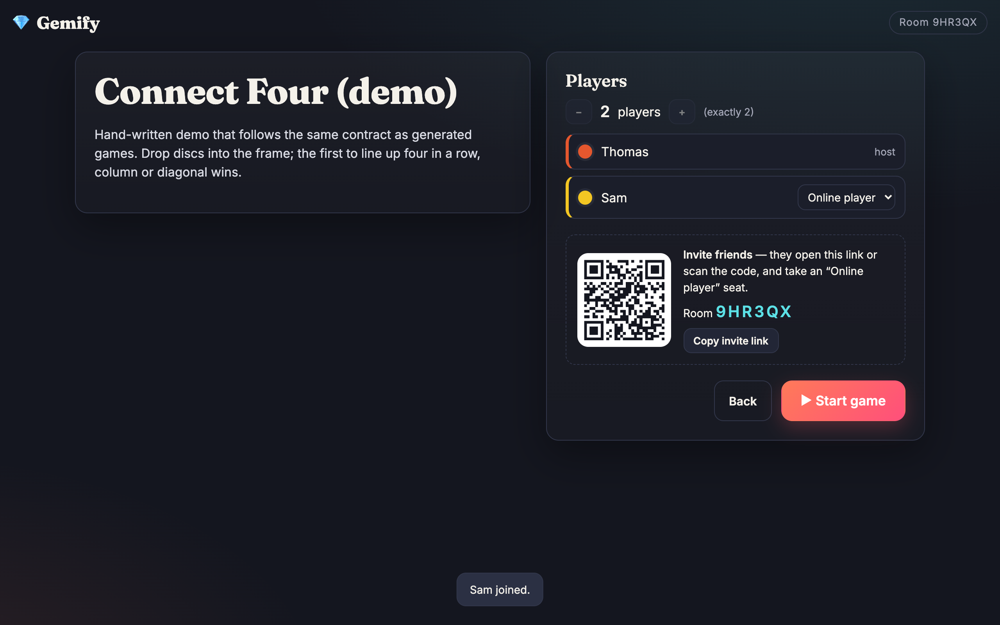
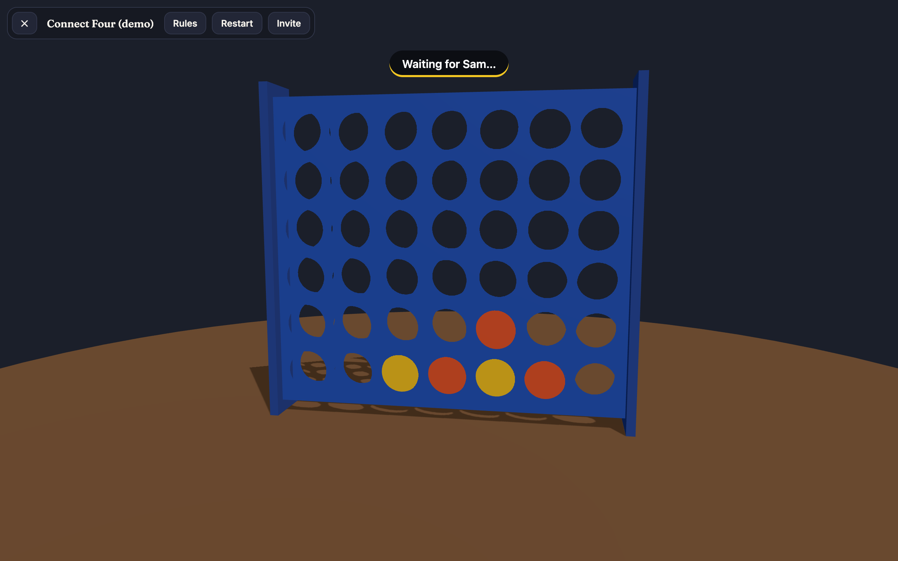
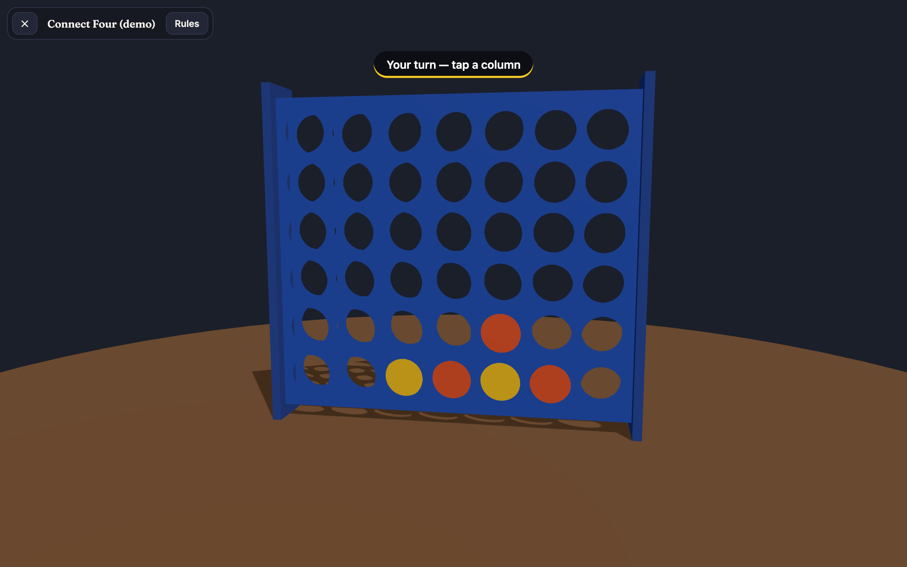
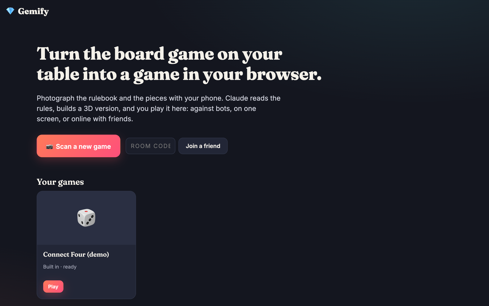

# 💎 Gemify

Photograph a board game with your phone, and Claude turns it into a 3D
browser game you can play against bots, on one screen, or online with friends.

1. Open Gemify on a computer and click **Scan a new game**. You get a QR code.
2. Scan it with your phone. The phone asks for **every rulebook page**, then
   **the components** (board, card types, pieces, tokens…). Each photo goes
   straight to the computer, and the phone shows a ✓ once the computer has it.
3. Tap **Build my game**. The server sends the photos to Claude, which works
   out the rules and writes a three.js game module. The module is played out
   headless by bots before anyone sees it; if that fails, Claude gets the
   report and fixes it (up to two rounds).
4. In the lobby, pick the number of players and set each seat to *same screen*,
   *bot* or *online player*. Friends join with the invite QR code or link.

## Screenshots

**Scan with your phone.** The phone asks for every rulebook page, then the components. Each photo goes straight to the computer.

<p>
  
  
  
</p>

**The photos arrive on the big screen**, where you start the build:



**Claude builds the game.** Its reasoning streams in, and the rules test plays the game with bots and sends any problems back for a fix. This screenshot replays a scripted event stream; the UI is real.



**Pick the players.** Each seat can be on the same screen, a bot, or an online friend who joins with the invite code.



**Play.** The host runs the rules; everyone sees the same 3D table.

<p>
  
  
</p>

<details><summary>Home screen</summary>


</details>

The screenshots are generated with Playwright against the real app (a host, a phone and a second player), using the built-in Connect Four demo. To regenerate them:

```bash
npm run screenshots
```

## Run it

```bash
npm install
```

Then start it with whichever credential you have:

```bash
npm start
```

That works if you're logged into Claude Code on this machine. With a token
from `claude setup-token` (for a server, CI…):

```bash
CLAUDE_CODE_OAUTH_TOKEN=sk-ant-oat01-... npm start
```

With an Anthropic API key from console.anthropic.com:

```bash
ANTHROPIC_API_KEY=sk-ant-api03-... npm start
```

### Two ways to reach Claude

| Backend | Used when | How it builds a game |
|---|---|---|
| `claude-code` | no API key is set (default) | Runs **Claude Code** through the Agent SDK in the game's folder. It reads the photos itself, writes `game.js` and `summary.md`, and runs `node lib/check.mjs game.js` until the rules check passes. Permissions are deny-by-default (`dontAsk`): read, write and edit files, plus that one command. |
| `api` | `ANTHROPIC_API_KEY` is an API key | One streamed Messages API call with all photos, then up to two fix rounds driven by the same check. |

Claude Code subscription tokens only work through Claude Code, not the raw
API, which is why there are two backends. Use the subscription route for your
own games. A public Gemify for other people should use an API key.

- Computer: <http://localhost:3000>
- Phones: the QR code points at `https://<your-LAN-IP>:3443`. The server
  makes a self-signed certificate for it, so the phone shows a warning once.
  Accept it.

Phones need **HTTPS**. Trystero needs `crypto.subtle`, which browsers only
expose on secure origins. You have three options:

| Setup | How |
|---|---|
| Same Wi-Fi (default) | Nothing to do: self-signed HTTPS on port 3443 |
| Tunnel (no warning) | `cloudflared tunnel --url http://localhost:3000`, then `PUBLIC_URL=https://….trycloudflare.com npm start` |
| Deployed | Run behind any HTTPS host, set `PUBLIC_URL` |

Without any credentials you can still try the built-in **Connect Four (demo)**.
It's hand-written against the same contract as generated games, so it covers
the whole runtime and multiplayer path.

| Env var | Default | |
|---|---|---|
| `CLAUDE_CODE_OAUTH_TOKEN` | — | `claude setup-token` token (otherwise the local Claude Code login) |
| `ANTHROPIC_API_KEY` | — | switches to the `api` backend |
| `GEMIFY_BACKEND` | auto | force `api` or `claude-code` |
| `GEMIFY_MODEL` | `claude-opus-5-5` | used by both backends |
| `GEMIFY_DEBUG` | — | print Claude Code's stderr |
| `GEMIFY_EFFORT` | `high` | `low` … `max` |
| `PORT` / `HTTPS_PORT` | `3000` / `3443` | |
| `PUBLIC_URL` | — | base URL used in QR codes and invite links; disables the self-signed HTTPS server |
| `HTTPS=0` | — | turn off the self-signed HTTPS server |

## How it fits together

```
 phone (scan.html) ──photos (WebRTC)──▶ host browser (index.html) ──POST photos──▶ server.js ──▶ Claude
                                               │   ◀──── SSE progress / game.js ────┘   │
                                               │                                lib/simulate.mjs
                                       authority iframe                     (bots play it headless)
                                       runs the rules
                                               │
                    guests (index.html?join=CODE) ◀── per-seat views / intents (WebRTC) ──┘
```

### Multiplayer

- [Trystero](https://trystero.dev/) over WebRTC, with peers discovered through
  public Nostr relays. Game traffic and photos never touch our server.
- A 6-character room code (no `0/O/1/I`) that is also the room password.
- **The host is the authority.** It runs the rules and owns the state. Guests
  only send intents (`{action}`) and render the snapshots they get back.
- The host checks which seat each intent comes from. A guest can only act for
  the seat bound to its client id, and the generated `applyAction` also checks
  turn order.

On top of that:

- **Roles.** Every peer announces itself with `hi`: the phone as `scanner`,
  friends as `player`. One room covers the whole session.
- **Hidden information.** Each seat gets `playerView(state, seat)` rather than
  the full state, so hands and deck order stay on the host.
- **Reconnects.** A browser keeps a client id in `localStorage`, so a player
  who reloads gets their seat back and receives the latest view again.
- **Binary transfer.** Photos go over a Trystero binary action with metadata
  and progress. Each photo is confirmed with an `ack`.

| Channel | From → to | Payload |
|---|---|---|
| `hi` | everyone | `{role, name, client}` |
| `photo` | phone → host | JPEG bytes, metadata `{id, kind}` |
| `ack`, `status` | host → phone | receipt, build progress |
| `rmphoto`, `notes`, `done` | phone ↔ host | |
| `lobby` | host → player | game, seats, `yourSeat`, `started` |
| `view` | host → player | `playerView` snapshot for that seat |
| `act`, `name` | player → host | intent, display name |

### The generated game

Claude writes one ES module against the contract in
[`lib/prompt.js`](lib/prompt.js):

- **Rules:** pure functions over JSON state: `setup`, `activePlayers`,
  `applyAction`, `result`, `playerView` and `botAction`.
- **Renderer:** `createRenderer({THREE, addons, canvasHost, uiHost, sendAction, photos})`.

Generated code is untrusted, so it's isolated in two places:

- **Browser:** it runs in `<iframe sandbox="allow-scripts">` with an opaque
  origin, built from `srcdoc` with the runtime inlined
  ([`public/js/frame.js`](public/js/frame.js)). It can't read the page,
  cookies or storage, and it talks to the page only through `postMessage`.
- **Server:** the rules check runs in a child process under Node's permission
  model. It can read only the module and the simulator: no file writes, no
  child processes, and a 30-second kill switch. Treat this as a guard
  against accidents, not as a sandbox for hostile code.

If a game crashes while you play, the host gets **Fix it with Claude**. That
sends the error and the module back for repair and saves it as a new version
(the old one stays as `game.vN.js`).

## Layout

```
server.js                 static files, game store, generation jobs (SSE), HTTPS for phones
lib/prompt.js             the game contract and the prompts
lib/generate.js           picks the backend; Messages API: streaming, thinking summaries, fix loop
lib/claude-code.js        Claude Code backend (Agent SDK): agent writes + tests the game itself
lib/check.mjs             `node lib/check.mjs game.js`: the rules check as a command
lib/verify.js             runs simulate.mjs in a locked-down child process
lib/simulate.mjs          headless rules check: setup, bot games, JSON-only state
public/index.html, js/app.js      host + guest UI (home, capture, build, lobby, play)
public/scan.html, js/scan.js      phone scanner
public/js/net.js          Trystero rooms
public/js/session.js      parent side of the game iframe
public/frame.html, js/frame.js    sandboxed runtime: authority (rules, bots) or mirror
public/examples/connect-four.js   reference game for the contract
games/<id>/               meta.json, game.js (+ older versions), photos/
tests/                    node --test, no network needed
tools/screenshots.mjs     Playwright: regenerates docs/screenshots/
```

## Tests

```bash
npm test
```

The tests cover answer parsing and the rules check:

- non-JSON state
- illegal bot moves
- games that never end
- crashing on unknown actions
- file system access
- infinite loops

## Ideas for later

- Let the Claude Code backend open the game in a headless browser and click
  through a full game, so it can fix visual problems too, not only rules.
- Use photos of flat components (cards, the board) as textures more
  aggressively, with perspective correction.
- Save game state on the host so a match survives a reload.
